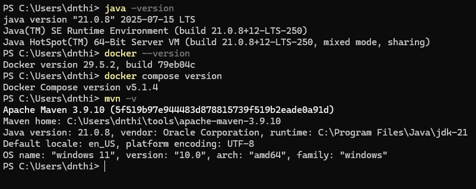
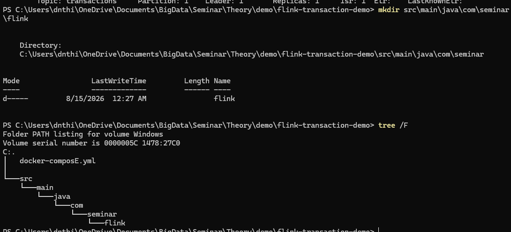
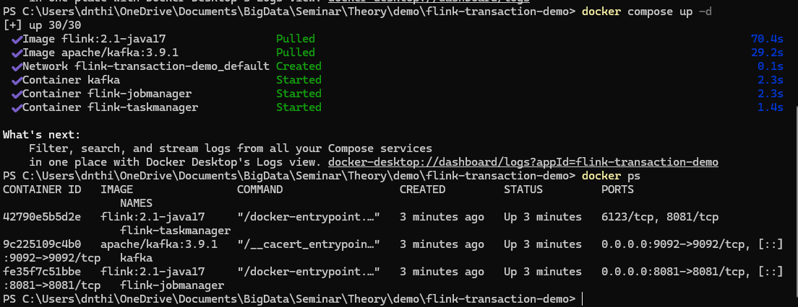
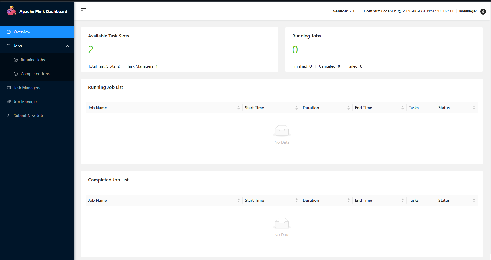
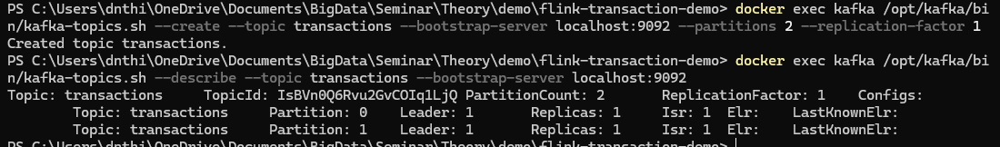
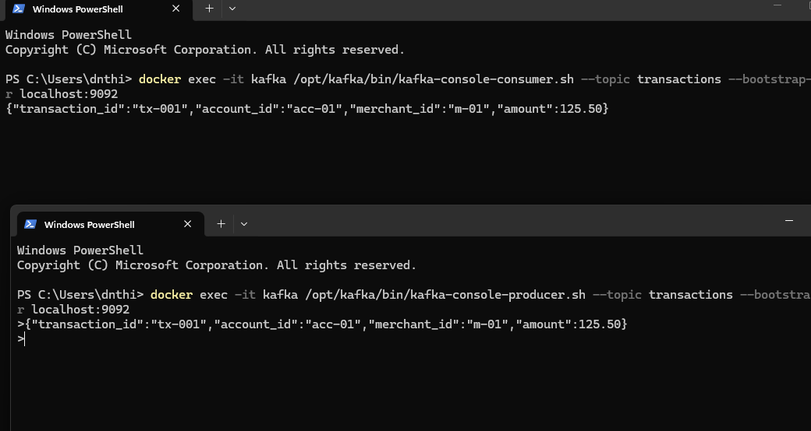
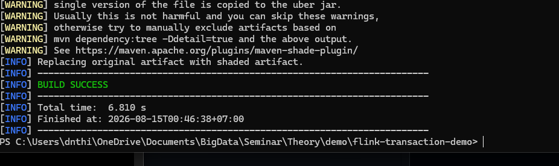
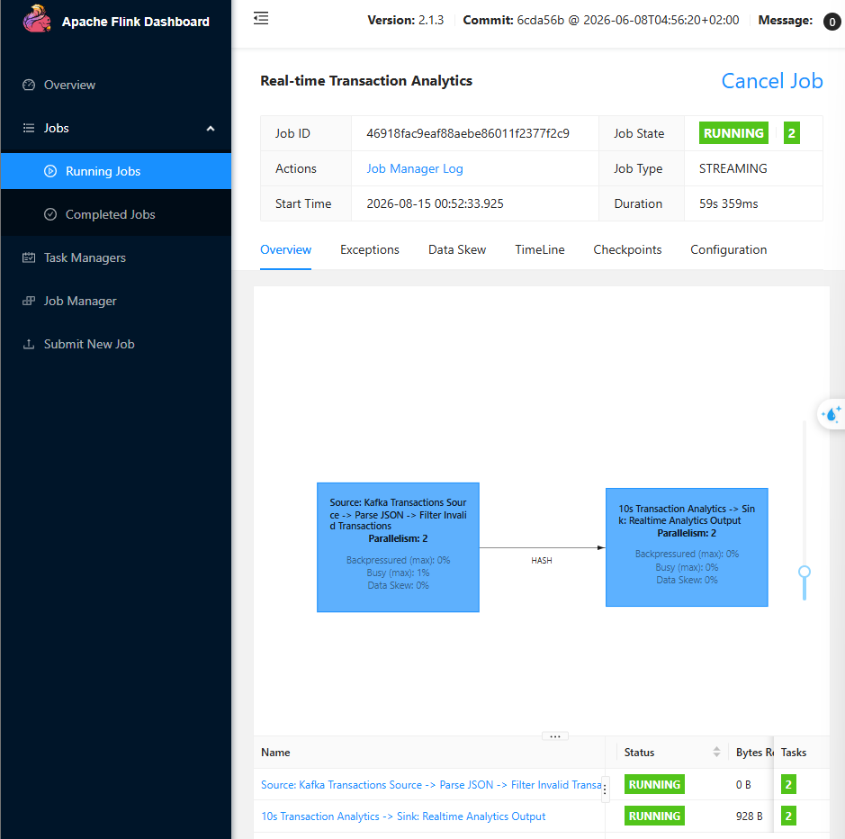
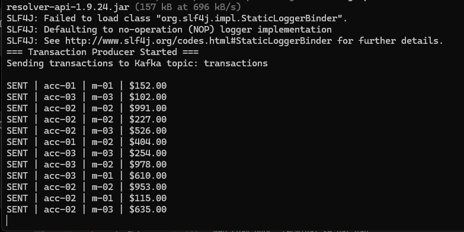
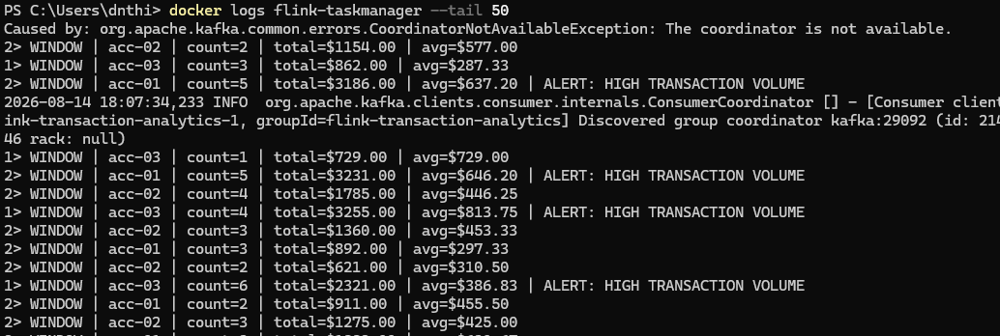

# Apache Flink Demo Report

Demo này minh họa một pipeline **real-time transaction analytics**:

```text
Transaction Producer
  -> Kafka topic: transactions
  -> Apache Flink Job
  -> Parse / Filter
  -> keyBy(account_id)
  -> 10-second Tumbling Window
  -> count + total + average
  -> Console Output / Alert
```

Mục tiêu khi quay demo là cho người xem thấy:

- Flink đọc stream liên tục từ Kafka.
- Flink biến job thành dataflow graph trên Web UI.
- Job chạy song song với parallelism/subtasks.
- Output cập nhật theo window.
- Checkpoint hoàn tất để minh họa fault tolerance.

> Lưu ý: phần cài đặt/chạy lệnh trong file này dùng để chuẩn bị và quay video. Khi thuyết trình, không trình bày chi tiết các bước cài đặt.

## 1. Kiểm Tra Môi Trường

Mở PowerShell và kiểm tra:

```powershell
java -version
docker --version
docker compose version
mvn -v
```

Kỳ vọng:

- Java/JDK đã có.
- Docker Desktop chạy được.
- Docker Compose hoạt động.
- Maven hoạt động.



## 2. Cấu Trúc Project

Thư mục demo hiện tại:

```text
flink-transaction-demo
|
|-- docker-compose.yml
|-- pom.xml
|-- src
|   `-- main
|       `-- java
|           `-- com
|               `-- seminar
|                   `-- flink
|                       |-- Transaction.java
|                       |-- TransactionProducer.java
|                       `-- TransactionAnalyticsJob.java
`-- target
```

Vai trò các file chính:

| File | Vai trò |
|---|---|
| `docker-compose.yml` | Dựng Kafka, Flink JobManager và Flink TaskManager. |
| `pom.xml` | Khai báo dependency Flink, Kafka connector, Jackson và build fat JAR. |
| `Transaction.java` | Model dữ liệu giao dịch để parse JSON. |
| `TransactionProducer.java` | Sinh transaction liên tục và gửi vào Kafka topic `transactions`. |
| `TransactionAnalyticsJob.java` | Flink job chính: Kafka source -> parse/filter -> keyBy -> window -> aggregate -> output. |



## 3. Docker Compose: Kafka + Flink

File [docker-compose.yml](flink-transaction-demo/docker-compose.yml) dựng 3 service:

- `kafka`: Kafka broker.
- `jobmanager`: Flink JobManager, mở Web UI ở `http://localhost:8081`.
- `taskmanager`: Flink TaskManager, cấu hình `taskmanager.numberOfTaskSlots: 2`.

Kafka dùng 2 listener:

- `localhost:9092`: cho producer chạy từ máy host.
- `kafka:29092`: cho Flink job chạy trong container kết nối tới Kafka.

Chạy cluster:

```powershell
cd "C:\Users\dnthi\OneDrive\Documents\BigData\Seminar\Flink\demo\flink-transaction-demo"
docker compose up -d
```

Kiểm tra container:

```powershell
docker ps
```

Cần thấy:

```text
kafka
flink-jobmanager
flink-taskmanager
```



Mở Flink Web UI:

```text
http://localhost:8081
```



## 4. Tạo Kafka Topic

Tạo topic `transactions` với 2 partitions:

```powershell
docker exec kafka /opt/kafka/bin/kafka-topics.sh --create --topic transactions --bootstrap-server localhost:9092 --partitions 2 --replication-factor 1
```

Nếu thành công:

```text
Created topic transactions.
```

Kiểm tra topic:

```powershell
docker exec kafka /opt/kafka/bin/kafka-topics.sh --describe --topic transactions --bootstrap-server localhost:9092
```

Kỳ vọng:

```text
Topic: transactions
PartitionCount: 2
ReplicationFactor: 1
```



Vì topic có 2 partitions, demo sẽ dễ nối với phần **parallelism/subtasks** hơn.

```text
transactions
  |-- Partition 0
  `-- Partition 1
        |
        v
    Flink Source
        |
        v
  parallel subtasks
```

## 5. Test Kafka Trước Khi Chạy Flink

Mục tiêu: xác nhận producer gửi được message, Kafka nhận được, consumer đọc được.

Mở 2 cửa sổ PowerShell.

Terminal 1: chạy consumer:

```powershell
docker exec -it kafka /opt/kafka/bin/kafka-console-consumer.sh --topic transactions --bootstrap-server localhost:9092
```

Terminal 2: chạy producer:

```powershell
docker exec -it kafka /opt/kafka/bin/kafka-console-producer.sh --topic transactions --bootstrap-server localhost:9092
```

Nhập thử một event:

```json
{"transaction_id":"tx-001","account_id":"acc-01","merchant_id":"m-01","amount":125.50,"event_time":"2026-08-14T10:00:01Z"}
```

Nếu terminal consumer hiện đúng JSON thì Kafka hoạt động ổn.



## 6. Build Flink Job

Project dùng Maven. File [pom.xml](flink-transaction-demo/pom.xml) có các dependency chính:

| Dependency | Mục đích |
|---|---|
| `flink-streaming-java` | DataStream API, `keyBy`, window, process. |
| `flink-connector-kafka` | Kafka source cho Flink. |
| `jackson-databind` | Parse JSON thành `Transaction`. |
| `maven-shade-plugin` | Đóng gói JAR để submit lên Flink. |

Build:

```powershell
mvn clean package
```

Kỳ vọng:

```text
BUILD SUCCESS
```

JAR sau khi build:

```powershell
dir target\*.jar
```

Ví dụ:

```text
flink-transaction-demo-1.0-SNAPSHOT.jar
```



## 7. Submit Flink Job

Copy JAR vào JobManager container:

```powershell
docker exec flink-jobmanager mkdir -p /opt/flink/usrlib
docker cp target\flink-transaction-demo-1.0-SNAPSHOT.jar flink-jobmanager:/opt/flink/usrlib/demo.jar
```

Kiểm tra:

```powershell
docker exec flink-jobmanager ls -lh /opt/flink/usrlib/
```

Submit job:

```powershell
docker exec flink-jobmanager flink run -d /opt/flink/usrlib/demo.jar
```

Nếu thành công:

```text
Job has been submitted with JobID xxxxxxxxxxxxxxxxx
```

Quay lại Flink Web UI:

```text
http://localhost:8081
```

Kỳ vọng:

```text
Running Jobs: 1
Real-time Transaction Analytics
Status: RUNNING
```



Trên Web UI cần quay được:

- Job name: `Real-time Transaction Analytics`.
- Job type: `STREAMING`.
- Parallelism: `2`.
- Job graph: Kafka Source -> Parse/Filter -> HASH -> Analytics -> Sink.
- Tab Checkpoints.

Lưu ý: Flink có thể **operator chaining**, nên Web UI có thể gộp nhiều operator thành vertex lớn. Đây là hành vi bình thường, không phải mất operator.

## 8. Chạy Transaction Producer

Mở PowerShell mới tại project:

```powershell
cd "C:\Users\dnthi\OneDrive\Documents\BigData\Seminar\Flink\demo\flink-transaction-demo"
```

Chạy producer:

```powershell
mvn exec:java "-Dexec.mainClass=com.seminar.flink.TransactionProducer"
```

Kỳ vọng terminal hiển thị liên tục:

```text
=== Transaction Producer Started ===
Sending transactions to Kafka topic: transactions

SENT | acc-01 | m-02 | $325.00
SENT | acc-03 | m-01 | $782.00
SENT | acc-01 | m-03 | $149.00
...
```



## 9. Xem Output Của Flink

Producer cứ để chạy. Mở PowerShell khác:

```powershell
docker logs flink-taskmanager --tail 50
```

Muốn xem realtime:

```powershell
docker logs -f flink-taskmanager
```

Kỳ vọng output dạng:

```text
WINDOW | acc-01 | count=3 | total=$1556.00 | avg=$518.67
WINDOW | acc-02 | count=4 | total=$2301.00 | avg=$575.25 | ALERT: HIGH TRANSACTION VOLUME
WINDOW | acc-03 | count=3 | total=$966.00 | avg=$322.00
```

Ý nghĩa:

- `count`: số giao dịch trong window.
- `total`: tổng tiền trong window.
- `avg`: giá trị trung bình.
- `ALERT`: xuất hiện khi tổng tiền vượt ngưỡng.



## 10. Kiểm Tra Checkpoints

Trong Flink Web UI:

```text
Job -> Checkpoints
```

Vì job có:

```java
env.enableCheckpointing(10_000);
```

nên sau một lúc cần thấy checkpoint trạng thái `COMPLETED`.

Đây là phần cần show trong video để chứng minh Flink có cơ chế fault tolerance.

## 11. Thứ Tự Quay Video Demo

Nên quay theo thứ tự này để video gọn trong 4-5 phút:

1. Mở slide demo overview, nói workflow Kafka -> Flink -> realtime output.
2. Mở Flink Web UI, chỉ job đang `RUNNING`.
3. Chỉ Job Graph và giải thích ngắn: Source -> operators -> Sink.
4. Chỉ parallelism/subtasks nếu màn hình dễ nhìn.
5. Chạy hoặc show terminal `TransactionProducer`.
6. Show output trong `docker logs -f flink-taskmanager`.
7. Mở tab Checkpoints, chỉ checkpoint `COMPLETED`.
8. Chốt: demo đã thể hiện stream processing, dataflow, parallel execution, state/window và checkpoint.

## 12. Checklist Trước Khi Quay

- [ ] Docker Desktop đang chạy.
- [ ] `docker compose up -d` đã chạy thành công.
- [ ] Kafka topic `transactions` đã được tạo.
- [ ] `mvn clean package` thành công.
- [ ] Flink job submit thành công và đang `RUNNING`.
- [ ] Producer sinh transaction liên tục.
- [ ] Output window aggregate hoặc alert xuất hiện.
- [ ] Checkpoint có trạng thái `COMPLETED`.
- [ ] Terminal font đủ lớn, khoảng 16-20px.
- [ ] Browser zoom 110-125% nếu chữ nhỏ.
- [ ] Tắt thông báo hệ thống trước khi quay.

## 13. Cách Chạy Lại Vào Ngày Quay

Mai mở máy thì chạy theo thứ tự này.

### 13.1 Mở Docker Desktop

Mở Docker Desktop và đợi Docker Engine chạy ổn.

### 13.2 Mở PowerShell tại project

```powershell
cd "C:\Users\dnthi\OneDrive\Documents\BigData\Seminar\Flink\demo\flink-transaction-demo"
```

### 13.3 Khởi động Kafka + Flink

```powershell
docker compose up -d
```

Kiểm tra container:

```powershell
docker ps
```

Phải có:

```text
kafka
flink-jobmanager
flink-taskmanager
```

### 13.4 Kiểm tra Kafka topic

```powershell
docker exec kafka /opt/kafka/bin/kafka-topics.sh --list --bootstrap-server localhost:9092
```

Nếu thấy:

```text
transactions
```

thì OK.

Nếu không thấy thì tạo lại:

```powershell
docker exec kafka /opt/kafka/bin/kafka-topics.sh --create --topic transactions --bootstrap-server localhost:9092 --partitions 2 --replication-factor 1
```

### 13.5 Submit Flink job lại

Vì `docker compose stop` hoặc restart thường giữ container, `demo.jar` có thể vẫn còn. Kiểm tra:

```powershell
docker exec flink-jobmanager ls -lh /opt/flink/usrlib/demo.jar
```

Nếu có JAR thì submit job:

```powershell
docker exec flink-jobmanager flink run -d /opt/flink/usrlib/demo.jar
```

Nếu mất JAR thì copy lại rồi submit:

```powershell
docker exec flink-jobmanager mkdir -p /opt/flink/usrlib
docker cp target\flink-transaction-demo-1.0-SNAPSHOT.jar flink-jobmanager:/opt/flink/usrlib/demo.jar
docker exec flink-jobmanager flink run -d /opt/flink/usrlib/demo.jar
```

### 13.6 Chạy producer ở PowerShell khác

Mở PowerShell mới:

```powershell
cd "C:\Users\dnthi\OneDrive\Documents\BigData\Seminar\Flink\demo\flink-transaction-demo"
mvn exec:java "-Dexec.mainClass=com.seminar.flink.TransactionProducer"
```

Sau đó mở Flink UI:

```text
http://localhost:8081
```

Kỳ vọng luồng chạy lại:

```text
Producer
   |
   v
Kafka
   |
   v
Flink RUNNING
   |
   v
Window / Alert
```

Kiểm tra output:

```powershell
docker logs flink-taskmanager --tail 30
```

Hoặc xem realtime:

```powershell
docker logs -f flink-taskmanager
```

## 14. Troubleshooting Nhanh

### Không vào được Flink Web UI

Kiểm tra container:

```powershell
docker ps
docker logs flink-jobmanager --tail 100
```

### Kafka topic đã tồn tại

Nếu tạo topic báo topic đã tồn tại thì bỏ qua và kiểm tra bằng:

```powershell
docker exec kafka /opt/kafka/bin/kafka-topics.sh --describe --topic transactions --bootstrap-server localhost:9092
```

### Flink job không đọc được Kafka

Kiểm tra trong code Flink job:

```java
.setBootstrapServers("kafka:29092")
```

Producer chạy từ máy host thì dùng:

```java
bootstrap.servers = localhost:9092
```

### Không thấy output ngay

Đợi ít nhất 10 giây vì job dùng tumbling window 10 giây.

### Không thấy checkpoint completed

Đợi thêm 20-30 giây, sau đó mở tab Checkpoints trong Web UI. Nếu vẫn không có, kiểm tra job có đang `RUNNING` không.

## 15. Dọn Môi Trường Sau Demo

Dừng container:

```powershell
docker compose down
```

Nếu muốn xóa cả dữ liệu container/network cũ:

```powershell
docker compose down -v
```


